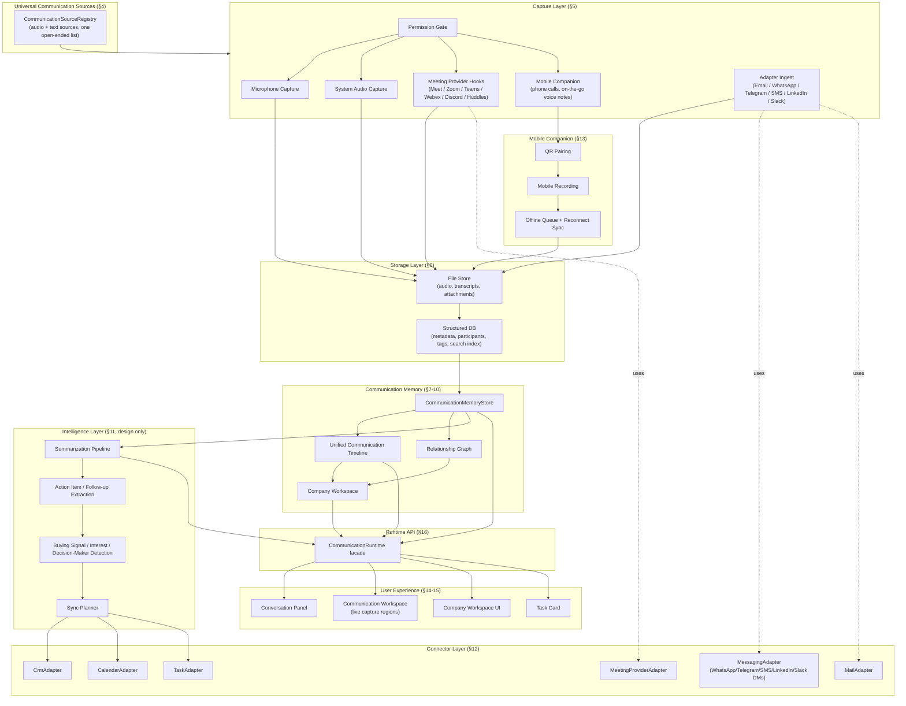
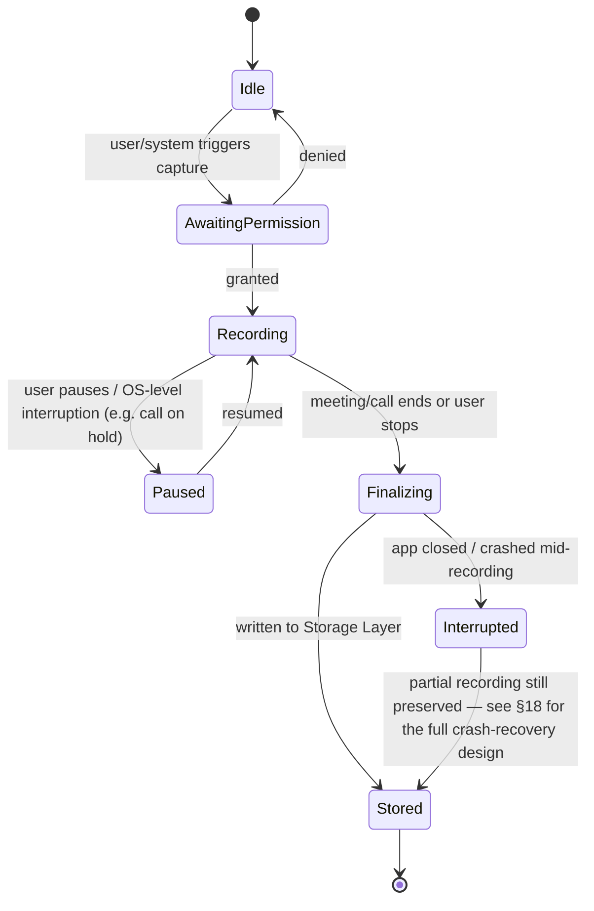
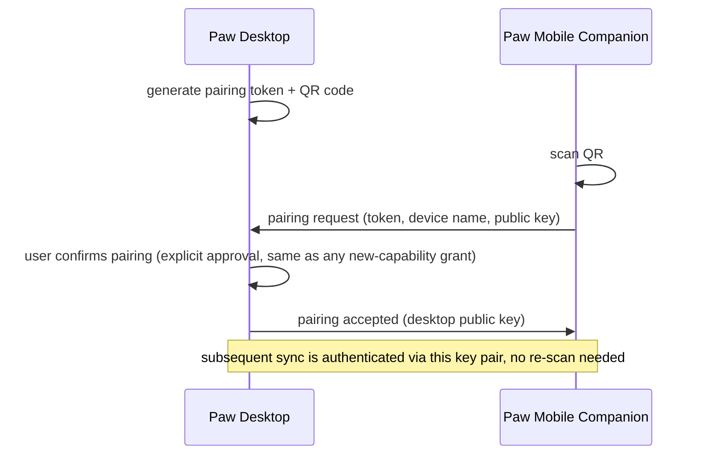
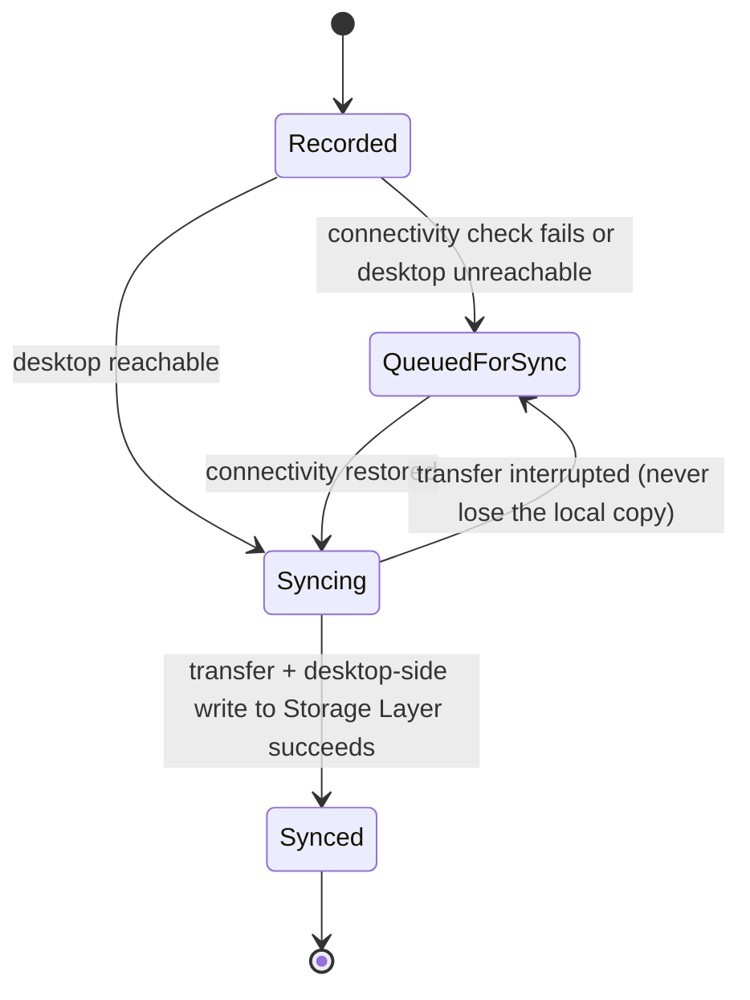
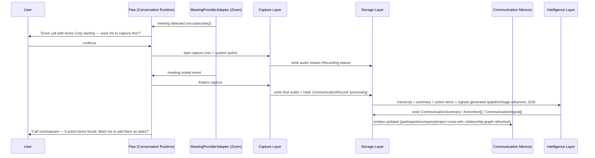
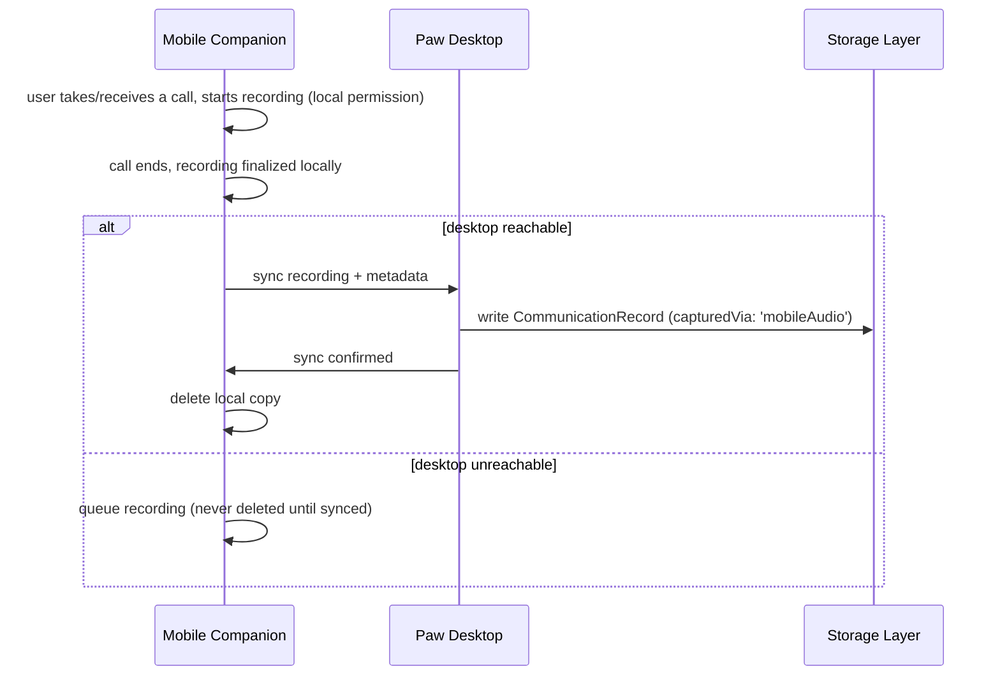
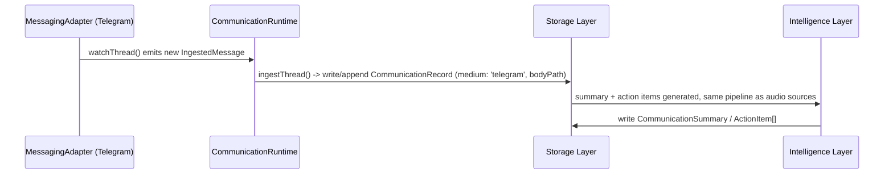
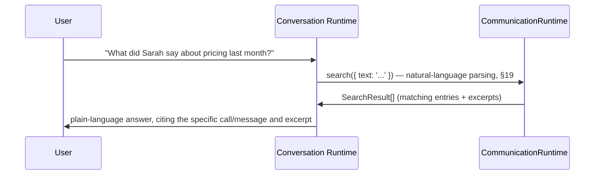
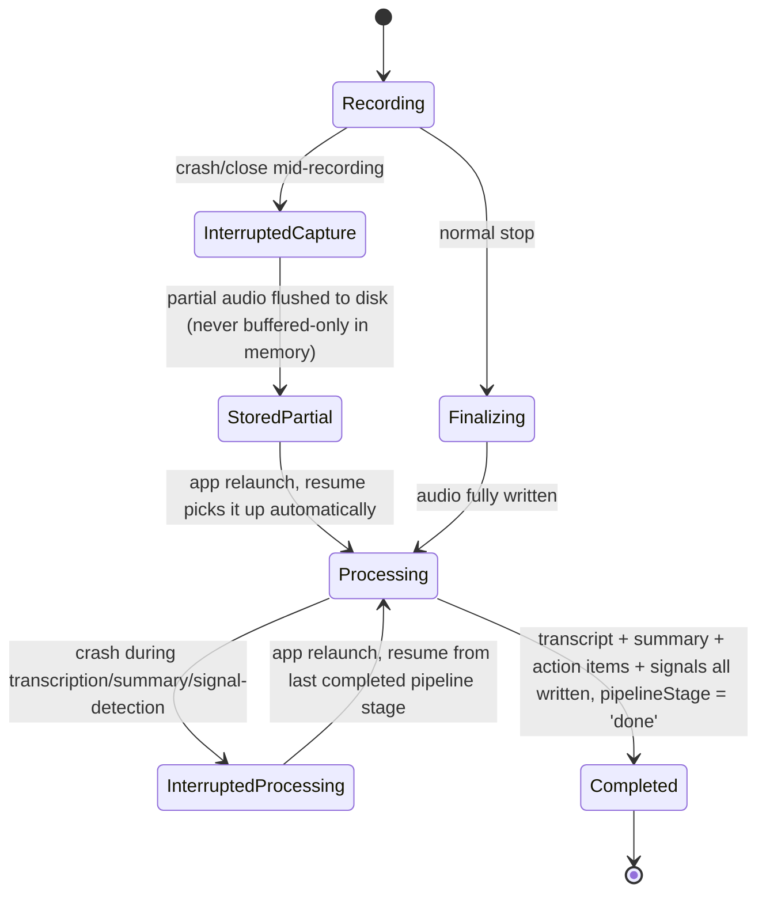

# Communication Intelligence Runtime — Architecture

Status: **design only, not implemented**. Coding Intelligence Runtime is
frozen (bug fixes only); this document plans the next runtime without
touching it. This is the **final architecture revision** before
implementation — after this pass, the architecture is frozen pending
implementation approval.

## 1. Mission

Paw already has a body (Companion), a voice (Conversation Runtime), and
hands (Universal Execution Runtime + Browser Runtime + Coding
Intelligence Runtime). Communication Intelligence Runtime gives Paw
**ears and memory for every conversation the user has** — in person, by
phone, in a meeting app, or in a message thread — so Paw can recall
what was said, who said it, and what needs to happen next, without the
user manually taking notes or exporting transcripts anywhere.

Design constraints from the mission, carried through every section
below:

- **Universal, not vertical.** One user (freelancer journaling voice
  notes) and one sales team (tracking buying signals across 40 calls a
  week) run on the exact same runtime. Nothing here is CRM-shaped by
  default — CRM is one *consumer* of the data, connected through an
  adapter, never baked into the core model.
- **Genuinely open-ended sources.** Every communication source — audio
  or text, real-time or ingested — fits through the same registry and
  entity model (§4). Adding Telegram or LinkedIn later is a new
  adapter file, never a schema or runtime change.
- **No tiers, no gating, no pricing.** Every capability below is
  designed as always-available. Tier mapping is a future, separate pass
  over this same architecture — it must not leak in now as
  half-finished flags or commented-out capabilities.
- **Never hardcode a vendor.** "Zoom," "HubSpot," "Google Calendar,"
  "Telegram" are adapter *implementations*, never names the core
  runtime, storage schema, or UI ever references directly. This
  mirrors the Browser Runtime precedent already in this codebase
  (`BrowserAdapter` / `ChromiumCdpAdapter` / `FirefoxAdapter` — one
  interface, swappable implementations, `BrowserRuntime` never
  branches on which browser it is).
- **Paw voice, not CRM software.** The user experience is "Paw
  remembers your conversations," not a pipeline board, a contacts
  grid, or a meeting-recorder dashboard bolted onto the companion.

## 2. How this composes with existing (frozen) runtimes

Communication Intelligence Runtime is a **new, additive layer** — it
does not modify Coding Intelligence Runtime, Browser Runtime, or the
Universal Execution Runtime's core contracts. It reuses their
already-proven shapes instead of inventing new ones:

| Existing precedent | Reused as |
|---|---|
| `ActionRequest` / `ActionResult` discriminated union (`src/shared/actions/ActionTypes.ts`) | Every new communication action (`startCapture`, `pairMobileDevice`, `syncCrmRecord`, ...) is a new member of the same union, executed through the same `DesktopExecutionEngine` plugin pipeline. No parallel execution engine. |
| `BasePlugin` / `DesktopPlugin` (`requirements` / `execute` / `describeInProgress` / `describeDone` / `prepare` / `observe` / `recover`) | Every capture/connector action is a plugin with the same lifecycle — including the existing confirm-before-destructive-action gate for anything like "delete this recording." |
| `BrowserAdapter` interface + capability set (`src/main/execution/browser/BrowserAdapter.ts`) | Direct template for `MeetingProviderAdapter`, `MessagingAdapter`, and every Connector Layer adapter (§12) — one interface, a `ReadonlySet` of declared capabilities, honest `NOT_IMPLEMENTED` results instead of silent no-ops. |
| `WorkspaceMemoryStore` / `ExecutionMemoryStore` / `ErrorMemoryStore` / `MemoryGraphStore` (`src/main/memory/`, `src/main/execution/`) | Template for `CommunicationMemoryStore` (§7) and the Relationship Graph (§10) — evidence-based, append-only records the model queries, never a black-box vector store the user can't inspect. |
| `ConversationSessionStore` (session persistence) | Sibling store, same on-disk convention (`src/main/conversation/` — see §6 folder layout) for communication session/recording metadata. |
| `WorkspaceRuntime` region contract (`goal` / `liveExecution` / `evidence` / `floatingSurface` / `browserPreview` / `gitTimeline`) | Direct template for the Communication Workspace region set (§14) — filled reactively, never a custom one-off screen. |
| `Task Card` lifecycle + `'running' | 'completed' | 'failed' | 'interrupted'` status | Recording/processing sessions surface as Task Cards — "Recording your call with Acme Corp," completing into "Call summarized, 3 action items found," or `Interrupted` if the app closes mid-call (same honesty fix as Priority 2 of Coding Intelligence Runtime, extended in §18). |
| `BrowserRuntime` as single facade over adapters | Direct template for `CommunicationRuntime` (§16) — the one object the rest of Paw ever calls into. |
| System prompt "infer, don't interrogate" / "complete the experience" philosophy (`systemPrompt.ts`) | Same voice extends here: Paw should surface "I noticed Sarah mentioned budget approval next week — want me to follow up?" unprompted, not wait to be asked. |

Nothing above requires modifying the frozen runtimes' source files —
they are dependencies this runtime consumes, the same way
`VisualVerificationPlugin` consumed `BrowserRuntime.captureScreenshot`
without changing it.

## 3. Component Diagram



## 4. Universal Communication Sources

The single design decision that lets every future source (Telegram,
SMS, LinkedIn, Slack DMs, whatever comes after) fit **without
redesign**: a communication source is never a hardcoded union member
baked into the runtime — it is an entry in an open-ended registry,
exactly the pattern `MeetingProviderId` and adapter `id` strings
already use elsewhere in this document.

```ts
export type CommunicationChannelKind = 'audio' | 'text' | 'mixed';

export type CommunicationCaptureMechanism =
  | 'desktopAudio'    // native mic/system-audio capture on this machine
  | 'mobileAudio'     // captured via a paired mobile device
  | 'adapterIngest';  // pulled in as text/voice through a Connector Layer adapter

export type CommunicationSourceDescriptor = {
  id: string;                 // 'faceToFace' | 'phoneCall' | 'googleMeet' | 'zoom' | 'teams'
                               // | 'webex' | 'discord' | 'slackHuddle' | 'voiceNote' | 'email'
                               // | 'whatsapp' | 'telegram' | 'sms' | 'linkedin' | 'slack' | ...
  displayName: string;
  channelKind: CommunicationChannelKind;
  capturedVia: CommunicationCaptureMechanism;
  requiresAdapter: 'meetingProvider' | 'messaging' | 'mail' | null;
};
```

A `CommunicationSourceRegistry` (sibling to `ConnectorRegistry`, §12.5)
holds every known descriptor. `CommunicationRecord.medium` (§6.3)
is `string`, validated against this registry at write time — not a
fixed TypeScript union — so the schema itself never needs to change
when a source is added.

| Source | channelKind | capturedVia | adapter |
|---|---|---|---|
| Face-to-face | audio | desktopAudio | none |
| Phone call | audio | mobileAudio | none |
| Google Meet / Zoom / Teams / Webex | audio | desktopAudio | meetingProvider (metadata only) |
| Discord / Slack Huddles | audio | desktopAudio | meetingProvider (metadata only) |
| Voice notes | audio | desktopAudio or mobileAudio | none |
| Email | text | adapterIngest | mail |
| WhatsApp / Telegram / SMS | text or mixed (voice messages) | adapterIngest | messaging |
| LinkedIn (messages) | text | adapterIngest | messaging |
| Slack (DMs/channels — distinct from Huddles) | text | adapterIngest | messaging |

Adding a new source is always exactly two steps, never more:
1. Register a `CommunicationSourceDescriptor`.
2. If `requiresAdapter` is non-null and no adapter of that kind exists
   yet for the specific vendor, implement one interface
   (`MeetingProviderAdapter` / `MessagingAdapter` / `MailAdapter`,
   §12). Capture Layer, Storage Layer, Communication Memory, the
   Unified Timeline, and the UI all already handle any registered
   source generically — none of them are touched.

This is the concrete mechanism behind "so future adapters fit without
redesign": the registry is the *only* place a new source name is ever
introduced.

## 5. Capture Layer

### 5.1 Sources and how each is captured

See §4's table for the full source list and mechanism. The mechanism
classes themselves are fixed and small (desktop audio, mobile audio,
adapter ingest) — it is the *source* list that grows, never the
mechanism list, which is what keeps this layer stable as sources are
added.

Notably:
- `desktopAudio`-class sources for a meeting provider (Zoom, Meet,
  Teams, Webex, Discord, Slack Huddles) all share **one identical
  capture path** — system audio + mic, kept as separate streams. The
  `MeetingProviderAdapter` (§12.1) is used only to *detect the meeting
  and its metadata* (title, participants, join/leave events); it never
  controls the raw audio path. This is why "Discord (future)" and
  "Slack Huddles (future)" need no new capture code — only a new
  adapter implementation, whenever built.
- `adapterIngest`-class sources (email, WhatsApp, Telegram, SMS,
  LinkedIn, Slack DMs) skip audio capture entirely — a `MessagingAdapter`
  or `MailAdapter` hands Storage Layer a ready-made
  `CommunicationRecord` (text medium) directly.

### 5.2 Permission model

Every capture source requires an explicit, source-specific grant before
first use — never a single blanket "allow Paw to listen":

```ts
type CapturePermission = {
  source: 'microphone' | 'systemAudio' | 'mobilePairing' | 'backgroundRecording';
  scope: 'oneTime' | 'session' | 'standing';   // 'standing' = until revoked, always visible in Settings
  grantedAt: number;
  revokedAt: number | null;
};
```

Rules:
- **Microphone** and **system audio** are separate OS-level permissions
  (Electron's `desktopCapturer` + `getUserMedia`) — granting one never
  implies the other.
- **Background recording** (capturing before the user explicitly says
  "start") is off by default and requires its own standing grant,
  surfaced identically to how the existing Universal Execution
  Runtime gates destructive actions — a real confirmation dialog, not
  a checkbox buried in settings.
- **Mobile pairing** consent is granted once per device pair (§13) and
  is revocable per-device, not globally — unpairing one phone never
  affects another.
- **Adapter-ingest sources** (email/messaging) require their own
  connector-level authentication (§12), which is a separate consent
  from any audio permission — connecting Telegram never implicitly
  grants microphone access, and vice versa.
- Every grant is inspectable and revocable from one place in the UX
  (§15) — "what can Paw hear, and from where" is always a single
  screen.

### 5.3 Background recording lifecycle



## 6. Storage Layer

### 6.1 Database vs. file storage — the split

Binary/large content and structured/queryable metadata are stored
separately, same principle already used across the app:

- **File storage**: raw audio, generated transcripts (as files, for
  portability/export), attachments (shared documents, meeting
  slides), generated summary documents, ingested message/email bodies
  for adapter-sourced communications.
- **Structured storage** (a local, file-backed structured store —
  same technology class as the existing `ConversationSessionStore` /
  memory stores, i.e. no new database engine introduced): metadata,
  participants, tags, companies, projects, search index, action
  items, sync state with connectors, relationship graph edges (§10).

The structured store never embeds large binary content — it always
holds a reference (file path) into the File Store.

### 6.2 Folder structure

```
<userData>/communication/
  recordings/
    <communicationId>/
      audio.mp3                     # raw capture, source of truth (audio sources only)
      audio-mic.mp3                 # (meetings only) isolated mic stream, if kept separate
      audio-system.mp3              # (meetings only) isolated system-audio stream
      transcript.json               # timestamped, speaker-tagged transcript (audio sources)
      transcript.txt                # plain-text export, human-readable
      body.txt                      # ingested message/email body (text sources)
      summary.md                    # generated summary, human-readable
      attachments/
        <original-filename>         # shared slides/docs, or message/email attachments
  index/
    communications.db               # structured metadata store (see §6.3)
    search.idx                      # full-text search index
    relationships.db                # relationship graph edges (see §10)
  sources/
    registry.json                   # CommunicationSourceDescriptor entries (see §4)
  companion-devices/
    <deviceId>.json                 # paired mobile device records (see §13)
  sync-state/
    <connectorId>/<communicationId>.json   # per-adapter sync bookkeeping (§12.6)
```

This sits alongside (not inside) the existing `ConversationSessionStore`
folder — communication history and chat-turn history are related but
distinct timelines, joined only through Communication Memory's own
cross-references, never merged into one file format.

### 6.3 Metadata schema (structured store)

```ts
type CommunicationRecord = {
  id: string;
  medium: string;                      // CommunicationSourceDescriptor id (§4) — open-ended, not a fixed union
  title: string;                       // inferred or user-set, never required up front
  startedAt: number;
  endedAt: number | null;              // null while in progress
  status: 'recording' | 'processing' | 'completed' | 'failed' | 'interrupted';
  pipelineStage: 'transcribing' | 'summarizing' | 'extractingActionItems'
               | 'detectingSignals' | 'updatingMemory' | 'done';   // see §18
  capturedVia: CommunicationCaptureMechanism;
  deviceId: string | null;             // set when capturedVia === 'mobileAudio'
  participants: string[];              // ParticipantRecord ids, see §7
  companies: string[];                 // CompanyRecord ids
  projects: string[];                  // ProjectRecord ids, user-defined groupings
  tags: string[];
  audioPath: string | null;
  transcriptPath: string | null;
  bodyPath: string | null;             // ingested text-source content (email/message)
  summaryPath: string | null;
  attachmentPaths: string[];
  sourceMeetingId: string | null;       // provider-native meeting id, from MeetingProviderAdapter
  sourceThreadId: string | null;       // provider-native thread id, from MessagingAdapter/MailAdapter
  createdAt: number;
  updatedAt: number;
};
```

### 6.4 Attachments, transcripts, notes

- **Attachments**: any file shared or referenced during a
  communication (slide deck, PDF, screenshot, or an email/message
  attachment). Stored under the communication's own folder, never
  scattered.
- **Transcripts**: generated once for audio sources, stored as both
  structured JSON (speaker-tagged, timestamped) and plain text — never
  regenerated silently; a re-transcription is an explicit, confirmed
  action. Text sources skip this and store `body.txt` directly.
- **Notes**: free-text, user-authored, attached to a
  `CommunicationRecord` post-hoc — stored as its own small file per
  communication, editable independent of the auto-generated summary.

### 6.5 Search indexing

Covered in full in §19 (Advanced Search) — this layer provides the
underlying full-text index (`fuse.js`-class fuzzy search, no new
search engine dependency) that both the plain and natural-language
query paths sit on top of.

## 7. Communication Memory

Communication Memory is the layer that turns stored recordings into
something Paw can *reason over in conversation* — the direct sibling
of `MemoryGraphStore`/`WorkspaceMemoryStore`, evidence-based and
inspectable, never an opaque embedding blob the user can't see into.

### 7.1 Entities

```ts
type ParticipantRecord = {
  id: string;
  name: string;
  role: string | null;            // "VP Sales", inferred or user-set
  companyId: string | null;
  emails: string[];
  phones: string[];
  externalHandles: { source: string; handle: string }[]; // e.g. { source: 'telegram', handle: '@sarah' }
  firstSeenAt: number;
  lastSeenAt: number;
  communicationIds: string[];     // every CommunicationRecord they appear in
};

type CompanyRecord = {
  id: string;
  name: string;
  domain: string | null;
  participantIds: string[];
  communicationIds: string[];
  projectIds: string[];
};

type ProjectRecord = {
  id: string;
  name: string;                   // user-defined grouping, e.g. "Acme renewal", "Q3 hiring"
  companyIds: string[];
  communicationIds: string[];
};
```

### 7.2 Read paths

Every derived view described later (Unified Timeline §8, Company
Workspace §9, Relationship Graph §10, Search §19) is computed from
these entities plus `CommunicationRecord[]` — Communication Memory
holds no separate persisted copy beyond the entity tables above,
matching `WorkspaceMemoryStore`'s "facts derived from real evidence,
not a cache that can go stale" discipline.

## 8. Unified Communication Timeline

A single chronological history spanning every source kind — meetings,
calls, emails, messages, and follow-ups — so "show me everything with
Acme Corp this quarter" is one query regardless of which mediums are
involved.

```ts
export type TimelineEntryKind = 'communication' | 'followUp';

export type UnifiedTimelineEntry = {
  kind: TimelineEntryKind;
  id: string;                       // communicationId or followUpId
  occurredAt: number;                // for followUp: suggestedWhen resolved to a timestamp, or createdAt if unresolved
  medium: string;                    // CommunicationSourceDescriptor id (§4), or 'followUp'
  participants: string[];
  companyIds: string[];
  projectIds: string[];
  headline: string;
  relatedCommunicationId: string | null; // for followUp entries, links back to the communication that generated them
};
```

Built as a **derived view, not separately stored data**: a merge-sort
over `CommunicationRecord[]` (by `startedAt`) and `FollowUp[]` (§11.2,
by `suggestedWhen`/`createdAt`), filtered by whatever scope the caller
asks for (participant/company/project/date range/medium). This is what
makes a call, two emails, and a WhatsApp thread appear correctly
interleaved without the caller ever branching on medium.

Rendering (ties to §9 Company Workspace and §14/§15 UX): grouped by
day, each entry showing a medium-specific icon + headline +
participants; clicking through opens the full `CommunicationRecord`
(transcript/summary/body) or, for a follow-up entry, the communication
that generated it.

## 9. Company Workspace

A single per-company "home" — not new stored data, a composed read
view over already-existing records, same "derived, not duplicated"
discipline as §8:

```ts
export type CompanyWorkspace = {
  company: CompanyRecord;
  projects: ProjectRecord[];
  participants: ParticipantRecord[];
  timeline: UnifiedTimelineEntry[];      // Unified Timeline (§8) scoped to this company
  files: CompanyFileRef[];                // attachments across every communication with this company
  openActionItems: ActionItem[];          // §11.2
  openTaskIds: string[];                  // Task Card ids created from this company's communications
};

export type CompanyFileRef = {
  path: string;
  communicationId: string;
  addedAt: number;
  originalFilename: string;
};
```

Assembly: given a `companyId`, gather every `CommunicationRecord`
referencing it (directly, or via a `ParticipantRecord`/`ProjectRecord`
that references it), union their attachments/action items/synced task
ids, and scope the Unified Timeline (§8) to that same set. This is the
concrete "Meetings, Calls, Files, Tasks, Timeline in one place"
surface, without a second copy of any of that data existing anywhere.

## 10. Relationship Graph

Formalizes the cross-references already present in §7.1's entities
(participant→company, communication→participant, etc.) into one
explicit, queryable graph — same evidence-based, inspectable
discipline as `MemoryGraphStore`.

```ts
export type RelationshipNodeKind = 'participant' | 'company' | 'project' | 'communication';

export type RelationshipNode = {
  kind: RelationshipNodeKind;
  id: string;                       // the record's own id
};

export type RelationshipEdgeKind =
  | 'participantWorksAt'              // participant -> company
  | 'participantInCommunication'      // participant -> communication
  | 'communicationAboutProject'       // communication -> project
  | 'projectForCompany'               // project -> company
  | 'communicationMentionsCompany';   // communication -> company (mentioned but not the primary company)

export type RelationshipEdge = {
  kind: RelationshipEdgeKind;
  from: RelationshipNode;
  to: RelationshipNode;
  evidenceCommunicationId: string | null;  // which communication established/confirmed this edge
};
```

The graph is a **computed projection** over the existing entity
cross-reference arrays (§7.1), refreshed whenever underlying records
change — never a separately-maintained mutable structure that can
drift out of sync. Persisted to `relationships.db` (§6.2) purely as a
queryable cache of that projection, rebuildable from source records at
any time.

This is what powers questions like "who else at Acme have I talked to
besides Sarah" or "which projects touch both Acme and Globex" as a
graph traversal instead of a bespoke join written per question.

## 11. Intelligence Layer (design only — no implementation)

Every capability below consumes a `CommunicationRecord` + its
transcript/body + related entities (participants, prior
communications with them, for continuity) and produces structured,
inspectable output — never a free-form paragraph the rest of the
system can't act on. This mirrors `analyzeUiReference.ts`'s
`responseSchema`-constrained JSON output discipline from Coding
Intelligence Runtime.

### 11.1 Meeting summaries

```ts
type CommunicationSummary = {
  communicationId: string;
  headline: string;              // one line
  summary: string;                // a few paragraphs, plain language
  keyPoints: string[];
  generatedAt: number;
  model: string;                  // which provider/model produced it, for auditability
};
```

### 11.2 Action items & follow-ups

```ts
type ActionItem = {
  id: string;
  communicationId: string;
  description: string;
  owner: string | null;           // participant name, if attributable
  dueHint: string | null;         // "next week", "before renewal" — natural language, not a forced date
  status: 'open' | 'done' | 'dismissed';
};

type FollowUp = {
  id: string;
  communicationId: string;
  reason: string;                  // "mentioned budget approval next week"
  suggestedAction: string;         // "send pricing follow-up"
  suggestedWhen: string | null;
};
```

Both feed into Paw's existing Task Card system as regular, user-
confirmable suggestions ("I noticed 3 action items — want me to add
them as tasks?") — never auto-created without the same confirm gate
every other action-with-side-effects already goes through.

### 11.3 Buying signals, decision-makers, interest detection

```ts
type CommunicationSignal = {
  communicationId: string;
  kind: 'buyingSignal' | 'decisionMaker' | 'interestLevel' | 'objection' | 'risk';
  participant: string | null;
  evidence: string;                // the actual quote/paraphrase that triggered this
  confidence: 'low' | 'medium' | 'high';
};
```

`evidence` is mandatory and always a real transcript/message excerpt —
the same "never invent an issue" discipline `verifyUiScreenshot`
already follows.

A personal user (no business context) simply never populates
`CommunicationSignal` — the field exists and is empty, not gated
behind a flag or a different code path.

### 11.4 CRM / Calendar / Task synchronization (design)

Sync is a **one-directional-by-default, explicit** flow: Communication
Memory → Connector, never silently pulling a CRM's existing data into
Paw's model without the user asking.

```ts
type SyncState = {
  communicationId: string;
  connectorId: string;             // e.g. 'hubspot', 'salesforce' — never referenced by name elsewhere
  externalRecordId: string | null; // what it became in the external system, once synced
  lastAttemptAt: number;
  lastResult: 'ok' | 'failed' | 'pending';
  lastError: string | null;
};
```

## 12. Connector Layer

Directly modeled on `BrowserAdapter` (§2) — one interface per
connector *kind*, many interchangeable implementations, the runtime
never branching on which vendor is active.

### 12.1 Meeting provider adapter

```ts
export type MeetingProviderId = string; // 'googleMeet' | 'zoom' | 'teams' | 'webex' | 'discord' | 'slackHuddle' | ...

export type MeetingProviderCapability =
  | 'detectActiveMeeting' | 'meetingMetadata' | 'participantList'
  | 'joinLeaveEvents' | 'calendarLink';

export type MeetingEvent =
  | { type: 'started'; meetingId: string; title: string; startedAt: number }
  | { type: 'participantJoined'; meetingId: string; participant: string; at: number }
  | { type: 'participantLeft'; meetingId: string; participant: string; at: number }
  | { type: 'ended'; meetingId: string; endedAt: number };

export interface MeetingProviderAdapter {
  readonly id: MeetingProviderId;
  readonly displayName: string;
  readonly capabilities: ReadonlySet<MeetingProviderCapability>;

  detect(): Promise<boolean>;                              // is this provider's app/session active?
  getActiveMeeting(): Promise<{ meetingId: string; title: string } | null>;
  getParticipants(meetingId: string): Promise<string[]>;
  subscribe(onEvent: (event: MeetingEvent) => void): () => void; // returns an unsubscribe fn
}
```

Notably: **this adapter never touches audio.** Its only job is
metadata so Capture Layer's generic system-audio/mic recording can be
tagged correctly. This is the concrete answer to "never hardcode Zoom
logic" — the actual capture path is provider-agnostic.

### 12.2 Messaging adapter

Generalizes WhatsApp/Telegram/SMS/LinkedIn/Slack DMs into one
interface — this is the piece that makes §4's "future adapters fit
without redesign" concrete for text-based sources:

```ts
export type MessagingCapability = 'readThread' | 'watchThread' | 'sendMessage';

export type IngestedMessage = {
  externalId: string;
  from: string;
  body: string;
  occurredAt: number;
  attachments: string[];
};

export interface MessagingAdapter {
  readonly id: string;                    // 'whatsapp' | 'telegram' | 'sms' | 'linkedin' | 'slack' | ...
  readonly displayName: string;
  readonly capabilities: ReadonlySet<MessagingCapability>;

  authenticate(): Promise<AdapterResult>;
  ingestThread(threadId: string): Promise<AdapterResult<CommunicationRecord>>;
  watchThread(threadId: string, onMessage: (msg: IngestedMessage) => void): () => void;
}
```

### 12.3 Mail adapter

Reuses the *pattern*, not the code, of Paw's existing SMTP/mail stack
(`src/main/mail/`) — a read/ingest-oriented adapter, separate from
Paw's own transactional email sending.

```ts
export type MailCapability = 'readThread' | 'watchInbox';

export interface MailAdapter {
  readonly id: string;                    // 'gmail', 'outlookMail', ...
  readonly capabilities: ReadonlySet<MailCapability>;

  authenticate(): Promise<AdapterResult>;
  ingestThread(threadId: string): Promise<AdapterResult<CommunicationRecord>>;
}
```

### 12.4 CRM adapter

```ts
export type CrmCapability = 'readContact' | 'writeContact' | 'readCompany'
  | 'writeCompany' | 'logActivity' | 'writeDeal';

export interface CrmAdapter {
  readonly id: string;                    // 'hubspot', 'salesforce', 'pipedrive', ...
  readonly displayName: string;
  readonly capabilities: ReadonlySet<CrmCapability>;

  authenticate(): Promise<AdapterResult>;
  findContact(query: { email?: string; name?: string }): Promise<AdapterResult<{ externalId: string } | null>>;
  upsertContact(contact: ParticipantRecord): Promise<AdapterResult<{ externalId: string }>>;
  logActivity(activity: { externalContactId: string; summary: string; occurredAt: number }): Promise<AdapterResult>;
}
```

### 12.5 Calendar adapter

```ts
export type CalendarCapability = 'readEvents' | 'matchMeeting' | 'createFollowUpEvent';

export interface CalendarAdapter {
  readonly id: string;                    // 'googleCalendar', 'outlookCalendar', 'ical', ...
  readonly displayName: string;
  readonly capabilities: ReadonlySet<CalendarCapability>;

  authenticate(): Promise<AdapterResult>;
  findEventForMeeting(meetingId: string, aroundTime: number): Promise<AdapterResult<{ eventId: string; title: string; attendees: string[] } | null>>;
  createFollowUpEvent(event: { title: string; when: number; attendees: string[] }): Promise<AdapterResult<{ eventId: string }>>;
}
```

### 12.6 Adapter registry

A single `ConnectorRegistry` (sibling to how `DesktopExecutionEngine`
registers plugins) holds every configured adapter instance, keyed by
kind + id. The Intelligence Layer's Sync Planner (§11.4) and Capture
Layer's ingest path (§5.1) ask the registry "give me the active CRM
adapter" / "give me the messaging adapter for this source id," never
import a vendor adapter directly.

## 13. Mobile Companion

### 13.1 QR pairing



Each paired device gets its own `<deviceId>.json` record (§6.2) — a
device is revoked individually, never as an all-or-nothing "sign out
everywhere."

### 13.2 Permissions (mobile side)

Same explicit-per-capability model as §5.2, mirrored on-device:
microphone (for voice notes / calls), and (platform-permitting) call-
audio access for phone call capture. The mobile app never assumes
desktop-granted permissions apply to it.

### 13.3 Recording

Mobile records to local device storage first, always — never assumes
connectivity. A recording is only "captured," never "synced," until
§13.4 completes.

### 13.4 Offline sync & reconnect



The local recording on the phone is only deleted after the desktop
confirms it was written to the Storage Layer — see §18 for the full
crash/interruption recovery design this participates in.

## 14. Communication Workspace design

The live-capture surface — direct sibling of `WorkspaceRuntime`'s
region contract (§2), reusing the exact same "declarative regions,
filled reactively, empty regions render nothing" discipline instead of
inventing a bespoke recording-studio UI.

```ts
export type CommunicationWorkspaceRegion =
  | 'liveTranscript' | 'participants' | 'detectedTopics' | 'actionItems' | 'evidence';

export type CommunicationWorkspaceState = {
  communicationId: string;
  regions: {
    liveTranscript: { latestLines: string[] } | null;
    participants: { names: string[] } | null;
    detectedTopics: { topics: string[] } | null;
    actionItems: { items: ActionItem[] } | null;   // pre-confirmation preview, not yet real Task Card items
    evidence: { durationSeconds: number; audioLevelOk: boolean; lastWriteAt: number } | null;
  };
};
```

Region-by-region:

- **`liveTranscript`**: a rolling window of the most recent transcribed
  lines, updated as transcription streams in — the same "show real
  progress, not a spinner" principle as the existing Task Card
  terminal output.
- **`participants`**: names detected/joined so far (from
  `MeetingProviderAdapter` join events where available, or inferred
  from voice/diarization otherwise) — grows during the call, never
  requires the user to pre-list attendees.
- **`detectedTopics`**: a small, running set of topic tags surfaced as
  the transcript accumulates — a lightweight preview, not the full
  Intelligence Layer analysis (§11), which runs after the call ends.
- **`actionItems`**: a live, unconfirmed preview of action items as
  they're detected mid-call — explicitly distinct from the real,
  user-confirmed `ActionItem[]` (§11.2) that gets offered as Task Card
  entries once the call ends and the full pipeline runs.
- **`evidence`**: real, verifiable proof capture is actually happening
  — elapsed duration, an audio-level sanity check (not silence the
  whole time), and the timestamp of the last successful write to
  disk. This is the direct extension of Coding Intelligence Runtime's
  "evidence must never silently disappear" principle into a live-
  capture context: if `lastWriteAt` stops advancing, that's visible
  to the user immediately, not discovered after the call ends.

Regions fill from `CommunicationRuntimeEvent`s (§16) — `transcriptUpdated`,
`participantDetected`, `actionItemDetected` — exactly the way
`WorkspaceRuntime`'s regions already fill from `ActionResult` data,
never a separate polling mechanism.

## 15. User Experience

General principles beyond the live-capture surface (§14) — no
mockups yet, this is the constraint set a future UI pass must satisfy:

- **One surface, not a new app.** Communication history, the Unified
  Timeline, and Company Workspace are reachable from the same
  Conversation Panel / dashboard shell Paw already has — not a
  separate window that looks like a CRM.
- **Ask in plain language, get plain language back.** "What did Sarah
  say about pricing last month?" is a normal chat message; Communication
  Memory answers it the same way any other Paw capability answers a
  question (see §19 Advanced Search) — no separate "search UI" the
  user has to learn.
- **Live indicator, not a dashboard.** While capturing, the existing
  Task Card pattern applies — "Recording your meeting with Acme Corp"
  — with the Communication Workspace (§14) available for anyone who
  wants to see the live detail, but never forced on-screen.
- **No CRM chrome.** No pipeline boards, no kanban, no "deal stages"
  UI. If a business user wants that, it lives in their actual CRM —
  Paw hands it data through the Connector Layer, it doesn't reimplement
  the CRM's UI. Company Workspace (§9) is a *reading* surface (meetings,
  calls, files, tasks, timeline in one place), never a data-entry form.

## 16. Runtime API

The public `CommunicationRuntime` facade — the one object the rest of
Paw (Conversation Runtime, Task Card, `IntentRegistry` tool
definitions) ever calls into, mirroring `BrowserRuntime`'s role as the
single entry point over adapters + capture.

```ts
export type TimelineScope = {
  participantId?: string; companyId?: string; projectId?: string;
  dateRange?: { from: number; to: number }; medium?: string;
};

export type SearchQuery = {
  text?: string;               // natural-language or keyword — see §19
  filters?: TimelineScope;
};

export type SearchResult = {
  entry: UnifiedTimelineEntry;
  matchedExcerpt: string | null;
  score: number;
};

export type CommunicationRuntimeEvent =
  | { type: 'captureStarted'; communicationId: string }
  | { type: 'captureStatusChanged'; communicationId: string; status: CommunicationRecord['status'] }
  | { type: 'transcriptUpdated'; communicationId: string; latestText: string }
  | { type: 'participantDetected'; communicationId: string; participant: string }
  | { type: 'actionItemDetected'; communicationId: string; actionItem: ActionItem }
  | { type: 'pipelineStageChanged'; communicationId: string; stage: CommunicationRecord['pipelineStage'] }
  | { type: 'processingComplete'; communicationId: string };

export interface CommunicationRuntime {
  // Capture
  requestPermission(source: CapturePermission['source']): Promise<AdapterResult>;
  startCapture(input: { medium: string; title?: string; sessionHint?: string }): Promise<AdapterResult<{ communicationId: string }>>;
  pauseCapture(communicationId: string): Promise<AdapterResult>;
  resumeCapture(communicationId: string): Promise<AdapterResult>;
  stopCapture(communicationId: string): Promise<AdapterResult>;

  // Mobile
  beginPairing(): Promise<AdapterResult<{ qrPayload: string }>>;
  listPairedDevices(): { deviceId: string; name: string; pairedAt: number }[];
  unpairDevice(deviceId: string): Promise<AdapterResult>;

  // Query / read
  getCommunication(communicationId: string): CommunicationRecord | null;
  getTimeline(scope: TimelineScope): UnifiedTimelineEntry[];
  getCompanyWorkspace(companyId: string): CompanyWorkspace;
  search(query: SearchQuery): Promise<SearchResult[]>;
  getRelationships(nodeId: string, kind: RelationshipNodeKind): RelationshipEdge[];

  // Intelligence (triggering, not implementing)
  requestSummary(communicationId: string): Promise<AdapterResult<CommunicationSummary>>;
  requestActionItems(communicationId: string): Promise<AdapterResult<ActionItem[]>>;

  // Sync
  syncToConnector(communicationId: string, connectorId: string): Promise<AdapterResult<SyncState>>;

  // Recovery (see §18)
  resumeInterrupted(): Promise<{ resumedCommunicationIds: string[] }>;

  // Lifecycle events (for Task Card / Communication Workspace to subscribe to)
  subscribe(onEvent: (event: CommunicationRuntimeEvent) => void): () => void;
}
```

Every new action type Paw's conversation layer needs
(`start_recording_meeting`, `search_communications`, ...) is a thin
`ActionRequest`/`IntentRegistry` wrapper around one of these methods —
same "IntentRegistry translates tool calls into ActionRequests,
plugins call into the real runtime" layering already used for Browser
Runtime and Coding Intelligence Runtime.

## 17. Execution Flow

### 17.1 Desktop meeting capture (e.g. Zoom)



### 17.2 Mobile phone call capture



### 17.3 Adapter-ingested source (e.g. a Telegram thread)



### 17.4 Ask-Paw query flow



## 18. Crash Recovery and Resume

Extends §5.3's Interrupted-status diagram to cover the **full
pipeline**, not just capture — a crash during transcription or
summarization must be just as recoverable as a crash during recording.
This is the direct extension of Coding Intelligence Runtime's Priority
2 (never report success for unfinished work) and Priority 3 (never
discard evidence) principles into this runtime.



Mechanism:
- Each pipeline stage — `transcribing` → `summarizing` →
  `extractingActionItems` → `detectingSignals` → `updatingMemory` →
  `done` — writes its own completion marker onto the
  `CommunicationRecord.pipelineStage` field (§6.3) *before* starting
  the next stage.
- On startup, `CommunicationRuntime.resumeInterrupted()` (§16) scans
  for every `CommunicationRecord` whose `status` is `'interrupted'` or
  `'processing'` but `pipelineStage !== 'done'`, and resumes from its
  last completed stage — never restarting a stage that already
  produced real output (avoiding wasted API calls, and avoiding
  duplicate summaries/action items).
- A record is only ever reported `status: 'completed'` when
  `pipelineStage === 'done'` — mirroring the exact Task Card status
  fix from Coding Intelligence Runtime: the lifecycle must always
  reflect reality, never inferred optimistically.
- Mobile-side (§13.4): a queued recording is never deleted locally
  until the desktop confirms the write succeeded — same "evidence
  survives an interrupted stage" principle applied to the sync path
  itself, not just the processing pipeline.

## 19. Advanced Search

Two-stage design: natural language on top of the same structured +
full-text foundation already used by the rest of this document (§6.5).

### 19.1 Query parsing

A natural-language query like *"what did Sarah say about pricing last
month"* is parsed into a structured intent — an LLM-assisted step
using the same `responseSchema`-constrained JSON discipline as the
rest of the Intelligence Layer (§11), never a free-text guess:

```ts
export type ParsedSearchIntent = {
  filters: TimelineScope;      // { participantId: '<Sarah's id>', dateRange: {...} }
  fullTextTerms: string[];     // ['pricing']
  originalQuery: string;
};
```

This step only ever *extracts filters* — it never performs the search
itself, keeping the same separation of concerns already used
throughout (Intelligence Layer produces structured data, something
else acts on it).

### 19.2 Execution

`filters` narrow the candidate `CommunicationRecord`/
`UnifiedTimelineEntry` set first (cheap, structured — participant/
company/project/date/medium), **then** `fullTextTerms` score/rank
within that narrowed set via the existing fuzzy-search index (§6.5).
Structured filtering always happens before full-text scoring, never
after — a broad term like "pricing" doesn't rank across the user's
entire history when a date/participant filter already narrows it to
three candidates.

### 19.3 Fallback

If query parsing produces no usable filters (a pure keyword query, or
parsing fails for any reason), `fullTextTerms` becomes the whole query
and search runs unfiltered across everything. Natural language is
strictly additive — a plain keyword search always works even if the
parsing step is unavailable or wrong.

### 19.4 Structured filters (direct, no parsing needed)

The UI (§15) also exposes `TimelineScope` filters directly — participant,
company, project, date range, medium — for anyone who wants to filter
without typing a sentence. Both paths converge on the exact same
`SearchQuery`/`SearchResult` shapes (§16), so there is only ever one
search implementation, not two.

## 20. Acceptance Plan

To be executed once implementation begins (this section defines
*what "done" means*, not a schedule):

1. **Face-to-face capture**: start a mic-only recording, stop it,
   confirm a `CommunicationRecord` + transcript + summary exist and
   are searchable by participant name typed in during/after.
2. **Desktop meeting capture (real provider)**: join a real Zoom/Meet
   call, confirm system audio + mic are captured as separate streams,
   confirm the `MeetingProviderAdapter` correctly tags title/
   participants without ever needing vendor-specific code outside the
   adapter file.
3. **Interrupted capture**: force-quit Paw mid-recording, relaunch,
   confirm the partial recording is preserved and status reads
   `interrupted`, never silently `completed`.
4. **Interrupted processing**: force-quit Paw after transcription
   completes but before summarization finishes; relaunch; confirm
   `resumeInterrupted()` picks up at `summarizing`, not from scratch,
   and never reports `completed` prematurely (§18).
5. **Mobile pairing**: pair a real phone via QR, record a voice note
   offline (airplane mode), reconnect, confirm sync completes and the
   local copy is only deleted after desktop confirms the write.
6. **Universal source extensibility**: register a new source
   descriptor (§4) plus a `MessagingAdapter` implementation (e.g.
   Telegram) and confirm zero core runtime/storage/timeline changes
   were needed to make it work end-to-end.
7. **Unified Timeline correctness**: confirm a company's timeline
   correctly interleaves a meeting, an email, and a messaging thread
   in true chronological order, alongside any pending follow-ups.
8. **Company Workspace correctness**: confirm files/tasks/action
   items assembled for one company are exactly the union of what's
   attached to that company's communications — no orphaned or
   duplicated entries.
9. **Relationship Graph**: confirm "who else at Acme have I talked to"
   and "which projects touch both Acme and Globex" resolve correctly
   via graph traversal, without a bespoke query per question.
10. **Search**: across 10+ real captured/ingested communications
    spanning at least 3 different mediums, confirm both a structured-
    filter search and a natural-language query ("what did X say about
    Y last month") return correct, relevant excerpts — not just
    keyword matches with no ranking.
11. **Action items → Task Card**: confirm a generated action item is
    only added as a real Paw task after explicit user confirmation,
    never silently.
12. **CRM sync (with one real adapter implemented, e.g. HubSpot)**:
    confirm a synced contact/activity is idempotent — running sync
    twice does not create duplicate external records.
13. **Adapter substitution**: swap the configured CRM adapter (e.g.
    HubSpot → Pipedrive) and confirm zero core-runtime code changes
    were needed — the same test Browser Runtime already passes for
    swapping browsers.
14. **Communication Workspace evidence**: during a live capture, force
    a transcription-stream stall and confirm the `evidence` region's
    `lastWriteAt` visibly stops advancing — proof the live indicator
    reflects reality, not an optimistic assumption.
15. **No feature gating check**: confirm every capability above behaves
    identically regardless of "single user" vs. "team" framing — there
    is no code path that checks a tier/plan to decide whether a
    capability runs.

## 21. Explicitly deferred

- Actual audio capture implementation, transcription provider choice,
  and diarization algorithm — this document defines the shape of the
  data they must produce, not which library/service produces it.
- Concrete `MeetingProviderAdapter`/`MessagingAdapter`/`MailAdapter`/
  `CrmAdapter`/`CalendarAdapter` implementations for any specific
  vendor — interfaces are final (§12), implementations are not built
  yet.
- Pricing tiers and feature gating — explicitly out of scope per the
  mission; revisit only after every runtime is complete.
- Communication Workspace's and Company Workspace's exact visual
  design (colors, layout pixels) — §14/§15 define constraints, not
  mockups.
- Mobile Companion's actual app shell/platform (iOS/Android/cross-
  platform framework) — out of scope for an architecture-only pass.
- The specific LLM prompt/schema used for natural-language query
  parsing (§19.1) — the shape (`ParsedSearchIntent`) is final, the
  prompt is an implementation detail for the build phase.
